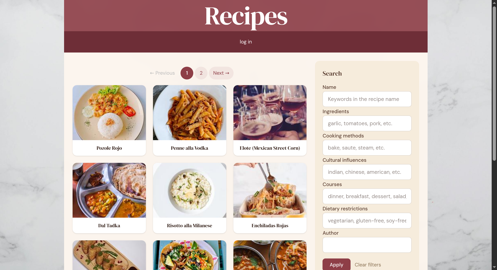
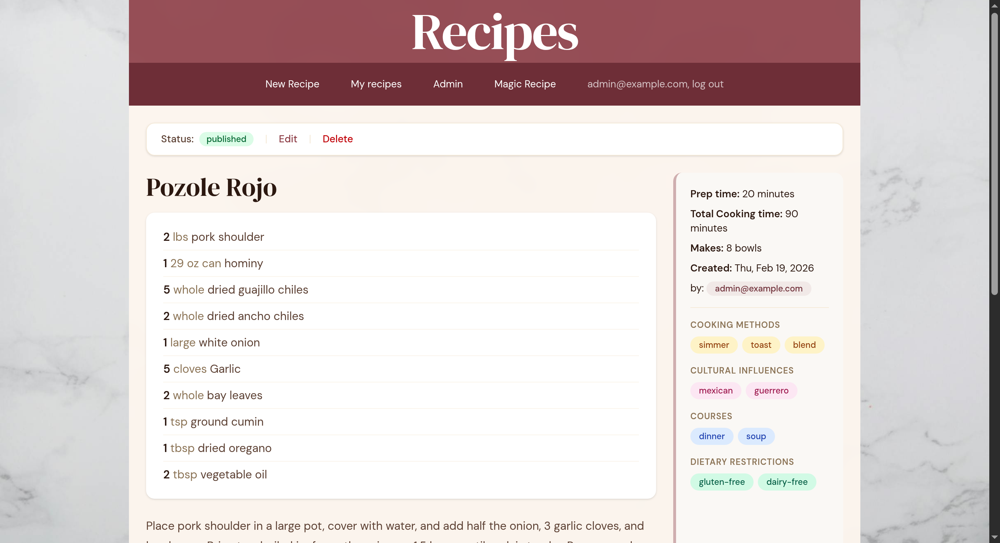
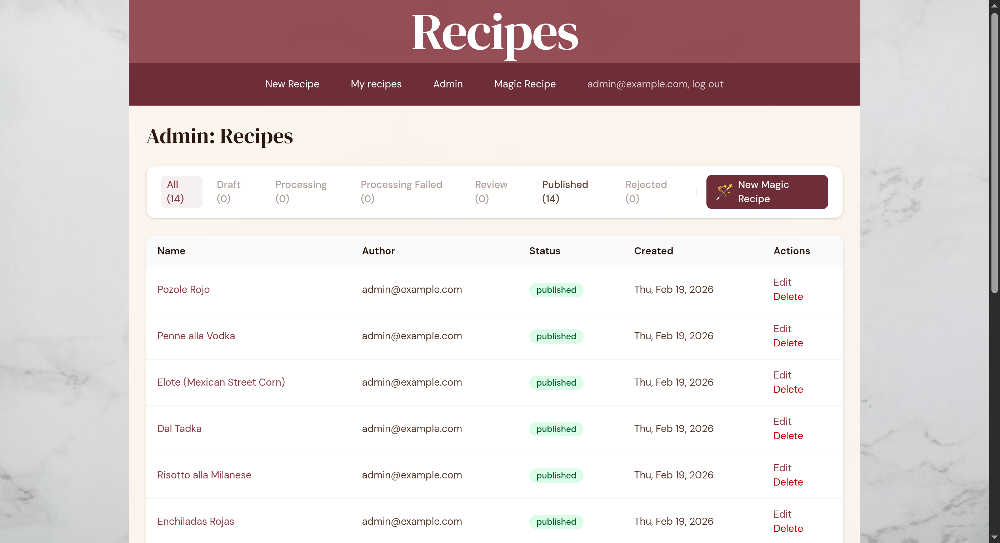

# MilkSteak

[](https://github.com/djcp/milk_steak/actions/workflows/ci.yml)

MilkSteak is a recipe tracker web application built with love.

## Features

- Create and edit recipes with ingredients, directions, images, and descriptions
- Tag recipes across four facets: cooking methods, courses, cultural influences, and dietary restrictions
- Browse and filter recipes by tags, name, ingredients, and author
- Autocomplete for tags, ingredients, units, and serving units
- AI-powered recipe import from URLs or pasted text (admin only, via Anthropic Claude)
- Admin workflow for reviewing, publishing, and rejecting recipes
- Image uploads with automatic variant generation (thumbnails, large)
- Pagination and SEO-friendly recipe URLs
- User authentication with Devise

## Screenshots

| Recipe browsing with tag-based filtering | Recipe detail with ingredients and tags |
|---|---|
|  |  |

| Admin recipe management with status filtering |
|---|
|  |

## Requirements

- **Ruby 4.0.1**
- **PostgreSQL 16+**
- **libvips** for image processing
  - macOS: `brew install vips`
  - Debian/Ubuntu: `sudo apt-get install libvips-dev`
- **Google Chrome** (for feature specs using Selenium)

## Setup

1. Clone the repository
2. Copy the sample environment file and fill in your values:
   ```bash
   cp .sample.env .env
   ```
3. Run the setup script:
   ```bash
   bin/setup
   ```

This installs dependencies, prepares the database, and starts the development server.

To set up without starting the server:

```bash
bin/setup --skip-server
```

### Environment Variables

See `.sample.env` for all available variables. Key ones for development:

| Variable | Purpose |
|---|---|
| `SECRET_KEY_BASE` | Rails secret key (generate with `bundle exec rake secret`) |
| `ANTHROPIC_API_KEY` | Required for AI recipe import |
| `DEFAULT_SENDER` | Devise mailer from address |

Production additionally requires S3 credentials (`AWS_ACCESS_KEY_ID`, `AWS_SECRET_ACCESS_KEY`, `S3_BUCKET_NAME`) and SMTP settings. See `CLAUDE.md` for the full list.

## Running the Application

```bash
bin/dev
```

This starts three processes via Foreman:
- **web** &mdash; Rails server (default port 3000)
- **css** &mdash; Tailwind CSS watcher
- **worker** &mdash; Solid Queue background job processor

## Testing and CI

```bash
# Run the full CI suite (Brakeman, Bundler Audit, RuboCop, RSpec)
bundle exec rake

# Run tests only
bundle exec rspec

# Run linter only
bundle exec rubocop
```

The CI suite runs on GitHub Actions against PostgreSQL 16 for every push to `master` and all pull requests.

## Tech Stack

- **Ruby 4.0.1** / **Rails 8.0**
- **PostgreSQL** with foreign key constraints
- **Propshaft** asset pipeline
- **Tailwind CSS v4** via `tailwindcss-rails` (no Node.js required)
- **Devise** for authentication
- **Active Storage** with local disk in development, S3 in production
- **Solid Queue** for background jobs
- **Anthropic Claude** for AI recipe extraction

## Architecture

### Model Diagram

See [docs/models.md](docs/models.md) for the full ER diagram.

### Key Components

| Component | Description |
|---|---|
| `Recipe` | Core model with statuses: `draft`, `processing`, `processing_failed`, `review`, `published`, `rejected` |
| `FilterSet` | PORO for compound recipe filtering (tags, name, ingredients, author) |
| `MagicRecipeJob` | Background job that extracts recipe data from URLs/text via Claude |
| `RecipeAiExtractor` | Sends source content to Anthropic API and parses structured response |
| `RecipeAiApplier` | Applies AI-extracted data to a Recipe (ingredients, tags, directions) |

### Recipe Lifecycle

Recipes follow a status-based workflow:

- **Manual creation:** User creates a recipe directly &rarr; `published`
- **AI import (admin):** `draft` &rarr; `processing` &rarr; `review` (or `processing_failed`) &rarr; `published` / `rejected`

## Image Credits

**Background image:** White marble surface by [Henry & Co.](https://www.pexels.com/photo/white-and-gray-marble-surface-1323712/) on Pexels (free for commercial use, no attribution required).

**Seed recipe images:** Sourced from [Unsplash](https://unsplash.com/) (free for commercial use, no attribution required).

## License

This program is licensed under the GPLv3 or later for non-commercial uses.
Commercial users can request a more permissive MIT license by contacting the author.

See LICENSE.txt for details.

Copyright (c) 2015 &ndash; Dan Collis Puro ([@djcp](https://github.com/djcp))
