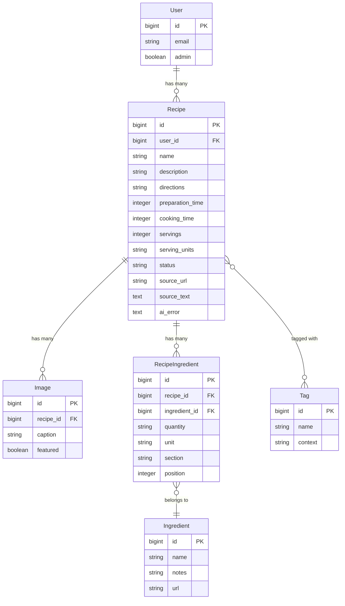

# Model Diagram

```mermaid
erDiagram
    User ||--o{ Recipe : "has many"
    Recipe ||--o{ Image : "has many"
    Recipe ||--o{ RecipeIngredient : "has many"
    RecipeIngredient }o--|| Ingredient : "belongs to"
    Recipe }o--o{ Tag : "tagged with"

    User {
        bigint id PK
        string email
        boolean admin
    }

    Recipe {
        bigint id PK
        bigint user_id FK
        string name
        string description
        string directions
        integer preparation_time
        integer cooking_time
        integer servings
        string serving_units
        string status
        string source_url
        text source_text
        text ai_error
    }

    Image {
        bigint id PK
        bigint recipe_id FK
        string caption
        boolean featured
    }

    RecipeIngredient {
        bigint id PK
        bigint recipe_id FK
        bigint ingredient_id FK
        string quantity
        string unit
        string section
        integer position
    }

    Ingredient {
        bigint id PK
        string name
        string notes
        string url
    }

    Tag {
        bigint id PK
        string name
        string context
    }
```
